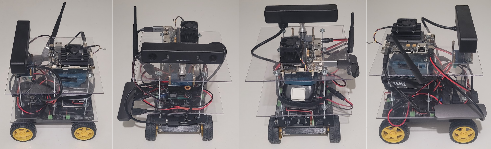
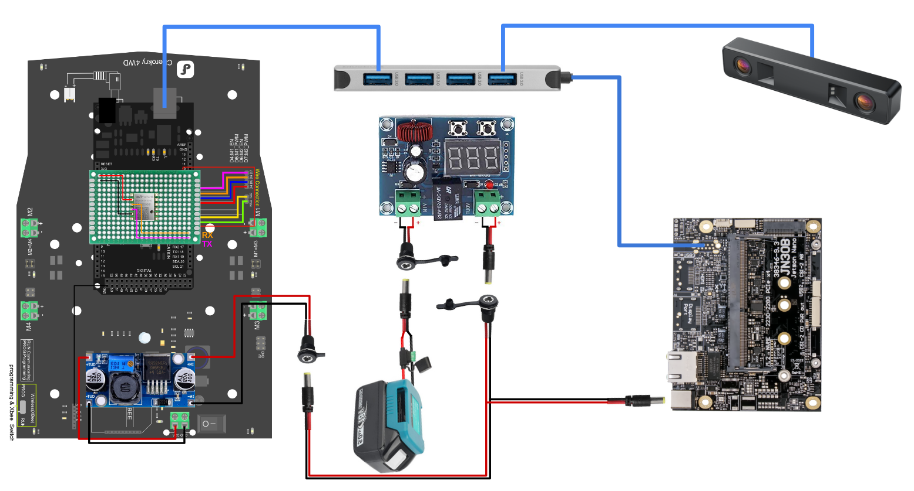
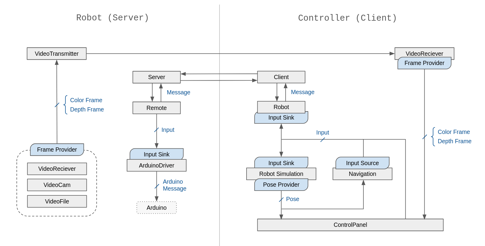
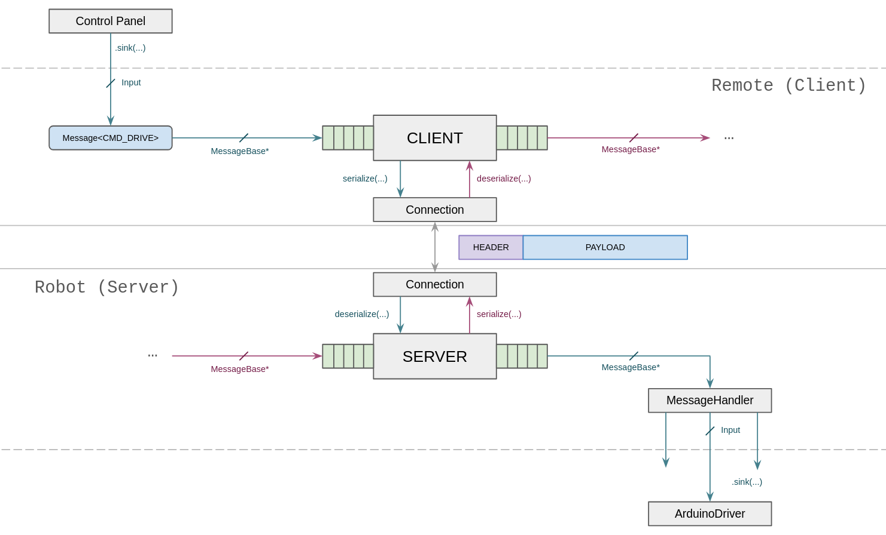

# Robotic Car Application
A C++ software suite to control and monitor a custom-built miniature vision-based robotic car. It provides both the on-target robot code and a custom, low-latency, OpenGL based GUI to control / monitor the robot remotely.


## Notable Highlights
- Low-latency visualization of remote camera stream (via ffmpeg)
- 3D pointcloud visualization (from stereo depth estimation)
- Real-time trajectory visualization
- Real-time user drive controls
- Unique OpenGL based GUI
- Tested on Linux 18.04 LTS (for Jetson Nano)
- Fully multi-threaded
- No use of OpenCV
- Modular design

## State of project
This project is made to consolidate all of the knowlegde I aquired at my previous job and some additional courses I completed. On top of that, it also gives me a deeper understanding of what it takes to create a robot, and gives me more hands-on experience accross the full stack of robot design and programming.

Because this project is only meant as a learning experience, and was built by just a single person, it could still benefit polishing, and could do with a major refactor.

Some ideas I would have implemented given more time:
- Track point cloud accross time, and build 3D mesh of environment.
- Do 2D trajectory optimization to calculate trajectory to target location commanded by user.
- Setup CI pipeline to make sure code does not break or result in worse performance.
- Give the user the ability to set a trajectory from the GUI, just by clicking.
- Improve code coverage for the unit tests.
- Add integration tests.
- Add regression tests.


## Installation & Setup
1. Clone this repository: `git clone https://github.com/KevinOrbie/robot-car-app ./RCA`

2. Download and setup the required thirparty packages, as described [here](./thirdparty/readme.md).

3. (__optional__) Update your `.bashrc` file to automatically source the `aliases.sh` file when starting a new terminal (adds a bunch of development aliases, starting with the "`rca-`" prefix). 

Code to add to Desktop `.bashrc`:
```bash
############# RCA #############
HOST=desktop
if [ -f <CORRECT_PATH>/RCA/aliases.sh ]; then
    source <CORRECT_PATH>/RCA/aliases_host.sh
fi
############# RCA #############
```

Code to add to Robot `.bashrc`:
```bash
############# RCA #############
HOST=robot
APP_ROOT=~/RCA
if [ -f ~/RCA/aliases.sh ]; then
    source ~/RCA/aliases_target.sh
fi
############# RCA #############
```

## Build
If not yet sourced in `.bashrc`, source the `aliases.sh` file for this shell session.
```shell
source alias.sh
```

By default, it is best to build for release:
```shell
rca-setup-build-release  # Setup Build System
rca-build-install        # Build & Install App
```

If you need to run `perf` or use `GDB`, build for debug (with debug symbols):
```shell
rca-setup-build-debug    # Setup Build System
rca-build-install        # Build & Install App
```

---
To build on the Jetson Nano, first copy the latest code to the robot with:
```shell
rca-sync-to-robot
```
Then SSH into the robot, and follow the same build instruction above.

## Run
### Application on Robot
This can be run on both the Jetson Nano, and on the local desktop:
```shell
rca-run engine 
```

For more information, use the `-h` option.

### GUI Application on Desktop
```shell
rca-run controller 
```

For more information, use the `-h` option.

### Unit Tests
```shell
# Build & Install
rca-test-setup-build
rca-test-build-install

# Run all tests
rca-test-run

# Run tests that match regex
rca-test-run <regex>
```


## Custom Built Car




| Component Name                    | Size                       |
| --------------------------------- | -------------------------- |
| JN30B & Jetson Nano Compute Module| 80mm x 104.6mm x 55mm      |
| Arduino Mega 2560 Rev3            | 53.4mm x 101.52mm x 15mm   |
| MYNT EYE D1000-120                | 165mm x 31.5mm x 30.12mm   |
| Cherokey 4WD Mobile Robot Base    | 204mm x 117mm              |
| Powertool Makita Battery          | 113mm x 75mm x 62mm        |
| Powertool Makita Charger          | /                          |
| Undervoltage battey protector     | 57mm x 19mm x 42mm         |
| DC-DC Buck converter              | 45mm x 20mm x 14mm         |
| USB 3.0 HUB                       | 90mm x 30mm x 10mm         |
| Wifi Adapter                      | /                          |
| 2x Plastic Plates                 | 20mm x 20mm x 1mm          |
| 1/4 inch / 6.35 mm mounting screw | /                          |
| Short Micro USB3.0 Calble         | 250mm                      |
| Long M3/M4 Rods                   | 140mm                      |
| M3/M4 Nuts + Washers              | /                          |
| Hex PCB Mounting screws           | M2, M3, M4                 |
| Powerwheel Adapter                | 94mm x 67mm x 28mm         |
| Velcro Strip                      | /                          |
| 5,5 x 2,5mm DC Power Connector    | /                          |
| 90 Angle USB3.0 junction          | 15mm x 30mm x 15mm         |
| Angled USB A/B connector          | /                          |

## Project Structure
The code for this project is split into multiple directories:
- **source**: the main source code for the application.
    - **arduino**: the code that runs on the on-board arduino.
    - **libraries**: multiple custom made libraries that are used inside the projects (main logic).
    - **projects**: projects that compile to an executable.
- **test**: all test related code, like unit-tests and integration tests.
- **pilots**: code that is not used by the main project, but was used to test seperate parts.

The code is written to allow for maximal modularity, enabling users to quickly put together a custom setup.
For example, during testing, it might be helpful to connect the robot directly to the development device, and test without the custom messaging system.
The modular design also makes is possible to run with multiple modules disabled, making both initial development and later testing easier.

Below you find a simplified dataflow diagram that might help to understand how the data flows between the most important top-level classes, and though which interfaces this is accomplished:


Below you find a simplified diagram of how messages flow through our custom messaging system:

