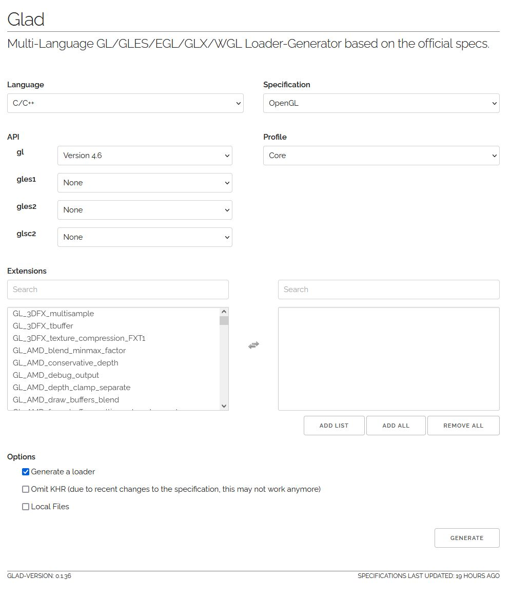

# Third Party Libraries
Below, we describe how to obtain the required libraries for this project.

## CMake 
Cross-platform free and open-source software for build automation, testing, packaging and installation of software by using a compiler-independent method. ([source](https://en.wikipedia.org/wiki/CMake))
```shell
sudo apt update
sudo apt install cmake
```

## V4L2 (Ubuntu 24.04)
A collection of device drivers and an API for supporting realtime video capture on Linux systems. ([source](https://en.wikipedia.org/wiki/Video4Linux))

Download all V4L2 development files:
```shell
sudo apt-get update
sudo apt-get install libv4l-dev     # libv4l consists of 3 different libraries: libv4lconvert, libv4l1 and libv4l2.

# Optional
sudo apt-get install v4l-utils      # Included: v4l2-clt (An application to control video4linux drivers).
```

## FFmpeg (Ubuntu 24.04)
Free and open-source software project consisting of a suite of libraries and programs for handling video, audio, and other multimedia files and streams. ([source](https://en.wikipedia.org/wiki/FFmpeg))

Download all ffmpeg development files:
```shell
sudo apt update
sudo apt install libavcodec-dev libavdevice-dev libavfilter-dev libavformat-dev libavutil-dev libpostproc-dev libswresample-dev libswscale-dev
``` 

## OpenCV (Ubuntu 24.04)
OpenCV is a library of programming functions mainly for real-time computer vision. ([source](https://en.wikipedia.org/wiki/OpenCV))
For this project we build OpenCV from source to make sure we are using version `3.4.20`.

Version requirements:
- **MYNT-EYE-D-SDK**: OpenCV version < 4.x ([source](https://mynt-eye-d-sdk.readthedocs.io/en/latest/sdk/install_ubuntu_src.html#install-sdk-dependencies))
- **Kimera**: OpenCV version >= 3.4.x

Download and build OpenCV from source; from the thirdparty directory, run:
```shell
# Download the correct OpenCV Version
git clone https://github.com/opencv/opencv.git
cd opencv/
git checkout tags/3.4.20

# Build OpenCV
mkdir _build
cd _build/

# Setup Build System
cmake ..

# Build 
make -j4  ## Fails

# Install
make install
``` 

## GLFW (Ubuntu 24.04)
A lightweight utility library for use with OpenGL. It provides programmers with the ability to create and manage windows and OpenGL contexts, as well as handle joystick, keyboard and mouse input. ([source](https://en.wikipedia.org/wiki/GLFW))

Specific compilation documentation can be found [here](https://www.glfw.org/docs/latest/compile.html).
From the thirdparty directory, run:
```shell
# Download Source Code
git clone https://github.com/glfw/glfw.git ./glfw
cd glfw

# Install dependencies
sudo apt install libwayland-dev libxkbcommon-dev xorg-dev

# Generate CMake Build System
cmake -B./_build

# Build & Install GLFW
cmake --build ./_build; cmake --install ./_build --prefix ./_deploy
```

## GLAD
Already **included** in version control.<br>
To keep custom and external code spereate, I created a CMake static library from the glad code.<br>
The glad code & headers were downloaded from the [GLAD website](http://glad.dav1d.de/), with the following settings:



## stb_image.h
Already **included** in version control.<br>
To keep custom and external code spereate, I created a CMake static library from the header file lib. <br>
This header only library was installed from [here](https://github.com/nothings/stb/blob/master/stb_image.h).

## GLM
OpenGL Mathematics (GLM) is a header only C++ mathematics library for graphics software based on the OpenGL Shading Language (GLSL) specifications. GLM provides classes and functions designed and implemented with the same naming conventions and functionalities than GLSL so that anyone who knows GLSL, can use GLM as well in C++.

Already **parially included** in version control.<br>
The CMake library basis is already created, with a glm scope, but the glm source code still needs to be downloaded.

Setup this library by doing the following:
1. Download the latest light (header only) source code from [here](https://github.com/g-truc/glm/tags).
2. Extract the zip file, and put the project directly under the `thirdparty/glm/include/glm/` directory (the root CMakeLists.txt file should be direcly under the `./glm/include/glm/` directory).

